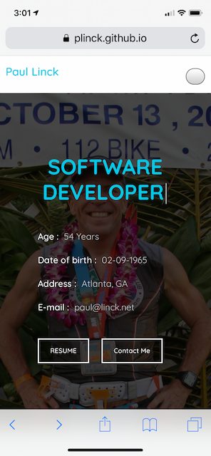
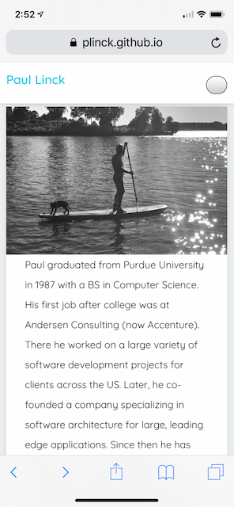
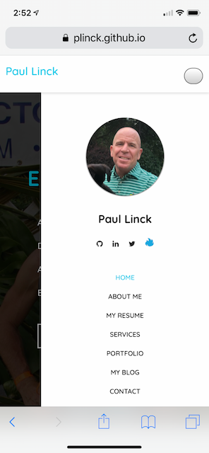
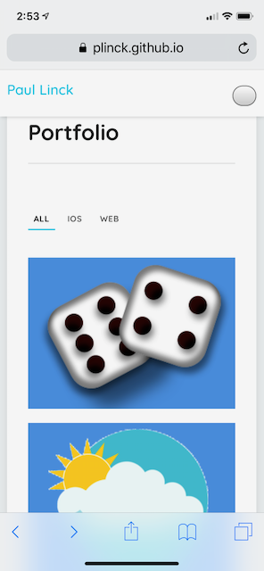
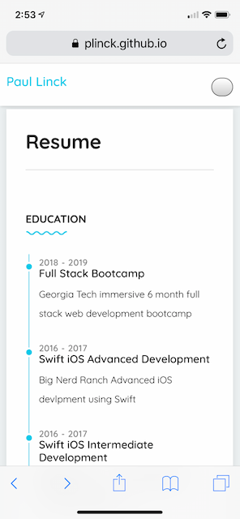

# My-Portfolio

## Overview

This is my latest updated portfolio.  I got started with a template and used several 3rd party css styles and js libraries to make an elegant, pleasing user experience.
* [Live Portfolio Page](https://plinck.github.io/My-Portfolio/)
* [GitHub Portfolio](https://github.com/plinck/My-Portfolio)

At this point it is geared towards the job skills I am most interested in. 

### Screenshots
  
  
 

### A few related items

* On my GitHib page ([GitHub Profile](https://github.com/plinck)) I pinned 6 of my related repositories

  * This includes my repositories and some I have contributed to

  * The web projects have a link to the deployed site

  * The iOS mobile applications have links to projects on GitHub

#### Content

My site has the following content:

* My name (with my titles/key skills scrolling on main page)

* Links to my GitHub profile, LinkedIn page, and Athlinks page as well as your email address and phone number

* A link to a PDF of my resume on resume page and home page

* List of projects (more than 3). For each project make sure you have the following:

  * Project title
  
  * More details for each project when clicking including description, images and links
  
    * Link to the code on GitHub

    * Link to the deployed version (not on mobile apps)
  
* External content:

  * Updated my LinkedIn page with the projects on this site

  * Updated the README for each project you linked to with a description of the problem,
  how I solved it, and some information about technical approach.  Most of this was already included

  * Refactored some of your code from earlier assignments to make them more readable.  Again, mnost of this was already done

#### Design

I focussed on the content of my portfolio page and the aesthetics. I used a single index.html file for all the pages to allow easy navigation and scrolling through the site.  This is a little  subjective, but I believe my site is "polished." I did use a 3rd party tremplate to get started and make it look and behave in a stunning manner.  This was a lot more work than I expected to due the need to learn addional libraries and CSS styles.

* It is completely responsive / mobile-friendly, with a mobile-first design.  It looks great on the web and looks fantastic on a mobile phone as I tested it throughly.

* It is polished. The template I used has a few color styles to choose from and I editted and created one of my own as well.  It looks nothing like the standard bootstrap stuff done up to this point.

* I put meaningful images for all of the projects.  Each project has an icon that is the app icon and additional images are provided in the project details page

#### To Do

* Review portfolio, resume and linkedin profile and ensure brand statement incorporated properly
